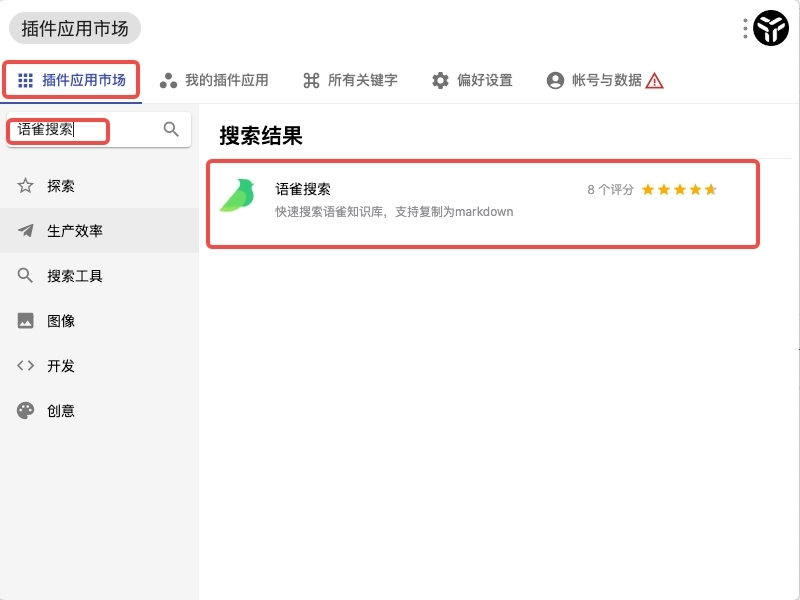
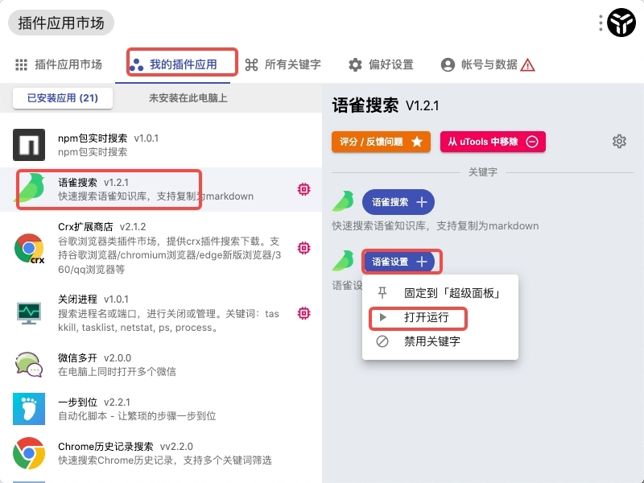
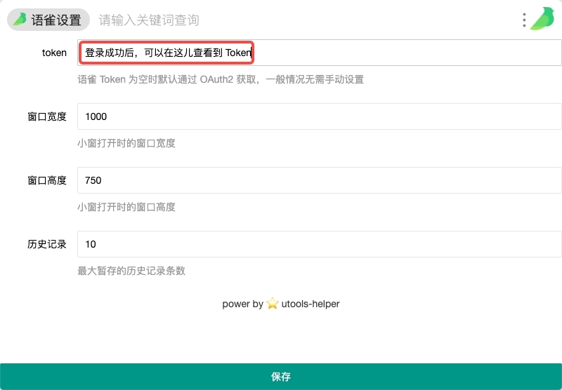

### 普通用户获取语雀 Auth-Token

这是一篇通过借助第三方工具，获取语雀 Auth-Token 的文档，可能需要您的电脑安装 utools 工具。
具体操作流程请查看以下内容。

### 下载 utools

[utools 官网](https://www.u.tools/)

### 安装 `语雀搜索` 插件
1. 打开 utools
2. 点击 `插件应用市场`
3. 搜索 `语雀搜索`
4. 点击 `安装`

### 登录插件，获取 Auth-Token
1. 点击 `我的插件应用`
2. 找到 `语雀搜索` 插件
3. 点击 `语雀设置`
4. 在弹出面板中点击 `运行`
5. 按步骤授权语雀登录即可
6. 登录成功后，重复 3-5 步骤，即可获取到 Auth-Token.

