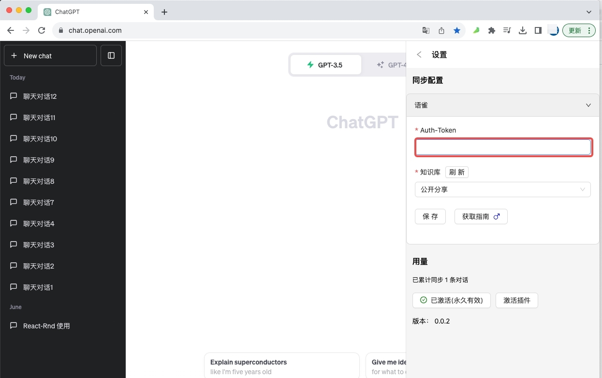
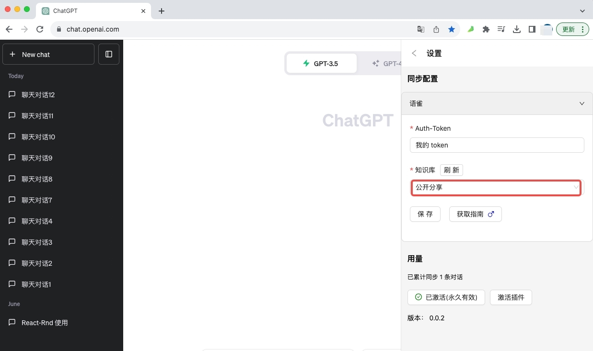

### 申请语雀 Auth-Token
[语雀官方文档](https://www.yuque.com/yuque/developer/api)

### 语雀会员用户
获取 Token 可通过点击语雀的个人头像，并进入 [个人设置](https://www.yuque.com/settings/tokens) 页面拿到，如下图：

### 录入 Auth-Token
将申请到的`语雀 Auth-Token`  填写到插件中，如下图位置：

### 选择知识库
在插件中选择你的知识库（请先点击刷新按钮），如下图位置：

录入完成后点击保存按钮即可
